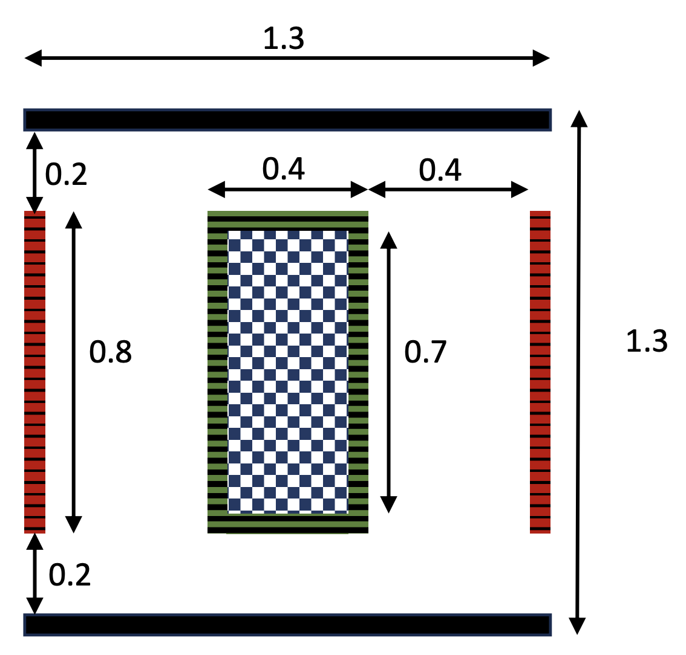

[](LICENSE) [](https://github.com/KiT-RT/CharmKiT/stargazers)
[](https://github.com/KiT-RT/charm_kit/actions/workflows/tests.yml)

# charm_kit: A wrapper for KiT-RT to conduct simulation sweeps fast


charm_kit is a benchmarking suite for the CharmNet project, providing automated parameter studies and test case management for the [KiT-RT PDE simulator](https://kit-rt.readthedocs.io/en/develop/index.html). It enables reproducible runs of radiative transfer test cases such as the lattice and hohlraum setups, using Python scripts to manage parameter sweeps, configuration, and result collection. charm_kit supports both high-performance computing (HPC) and local (no-HPC) execution modes, leveraging Singularity containers for reproducibility.


## Installation

Preliminaries:

1. Install [Singularity](https://docs.sylabs.io/guides/latest/user-guide/quick_start.html) on your system.

2. Clone the `charm_kit` Github repository:
   ```
   git clone git@github.com:ScSteffen/charm_kit.git
   ```

3. Install Poetry and create the project environment:
   ```
   python3 -m pip install --user poetry
   poetry install
   ```

4. Install [KiT-RT](https://github.com/KiT-RT/kitrt_code) as a submodule using the provided installer. (Requires root for container build.)
   ```
   bash install_KiT-RT.sh
   ```
   The repository is installed into `./kitrt_code/`.
   The installer always builds the CPU Singularity image + binary. If a CUDA GPU is detected (`nvidia-smi`), it also builds the CUDA Singularity image and `build_singularity_cuda` binary automatically.
   If updating KiT-RT:
   ```
   bash update_KiT-RT.sh
   ```
   If on a cluster without root, build the container locally and upload it to `charm_kit/kitrt_code/tools/singularity/`.

## Testing

Run unit tests from the repo root:

```bash
poetry install --with dev
poetry run pytest -q
```


## How charm_kit Works

charm_kit automates the setup, execution, and result collection for radiative transfer test cases using the KiT-RT solver. The workflow is managed by Python scripts (e.g., `run_hohlraum.py`, `run_lattice.py`) that:

- Define parameter sweeps for each test case (e.g., mesh size, quadrature order, absorption/scattering coefficients).
- Generate the necessary configuration files for KiT-RT.
- Run the KiT-RT solver inside a Singularity container for each parameter combination.
- Collect and save the results (e.g., quantities of interest) as `.npz` files for further analysis.

Scripts support both HPC (SLURM) and local (no-HPC) execution. 


## Running charm_kit Scripts

charm_kit provides test-case drivers:

- `run_lattice.py`
- `run_hohlraum.py`

Use Poetry to run commands in the project environment.

Each script has its own CLI parser. They share execution flags, but design-parameter flags are test-case specific. Print all flags with:

```bash
poetry run python run_lattice.py --help
poetry run python run_hohlraum.py --help
```

Execution and I/O flags:

- `--slurm`: Submit jobs through SLURM.
- `--singularity`: Run KiT-RT through the CPU Singularity image.
- `--cuda`: Run KiT-RT through the CUDA Singularity image (`--nv` is added automatically).
- `--csv CSV`: Read design parameters from CSV and write QOIs back to that CSV.
- `--config CONFIG`: Path to a TOML hyperparameter file.
- `-q`, `--quiet`: Suppress solver stdout/stderr output.

Shared parameter override flags:

- `--grid-cell-size GRID_CELL_SIZE`: Override spatial resolution for all runs.
- `--quad-order QUAD_ORDER`: Override angular quadrature order for all runs (must be even).

Lattice-specific parameter flags:

- `--abs-blue ABS_BLUE [ABS_BLUE ...]`: Override absorption coefficient(s) in blue lattice cells.
- `--scatter-white SCATTER_WHITE [SCATTER_WHITE ...]`: Override scattering coefficient(s) in white lattice cells.

Hohlraum-specific parameter flags:

- `--green-center-x GREEN_CENTER_X [GREEN_CENTER_X ...]`
- `--green-center-y GREEN_CENTER_Y [GREEN_CENTER_Y ...]`
- `--red-right-top RED_RIGHT_TOP [RED_RIGHT_TOP ...]`
- `--red-right-bottom RED_RIGHT_BOTTOM [RED_RIGHT_BOTTOM ...]`
- `--red-left-top RED_LEFT_TOP [RED_LEFT_TOP ...]`
- `--red-left-bottom RED_LEFT_BOTTOM [RED_LEFT_BOTTOM ...]`
- `--horizontal-left HORIZONTAL_LEFT [HORIZONTAL_LEFT ...]`
- `--horizontal-right HORIZONTAL_RIGHT [HORIZONTAL_RIGHT ...]`

Default hyperparameter files:
- `benchmarks/lattice/hyperparams.toml`
- `benchmarks/hohlraum/hyperparams.toml`

Precedence for hyperparameters is:
1. Command-line arguments
2. TOML values
3. Script hardcoded defaults

### Supported run setups

1. **Local mode, raw (no Singularity)**

   ```bash
   poetry run python run_lattice.py
   # or
   poetry run python run_hohlraum.py
   ```

   Uses local executable: `./kitrt_code/build/KiT-RT`.

2. **Local mode + Singularity (CPU)**

   ```bash
   poetry run python run_lattice.py --singularity
   # or
   poetry run python run_hohlraum.py --singularity
   ```

   Uses image/executable:
   `kitrt_code/tools/singularity/kit_rt.sif` and `./kitrt_code/build_singularity/KiT-RT`.

3. **Local mode + Singularity + GPU**

   ```bash
   poetry run python run_lattice.py --cuda
   # or
   poetry run python run_hohlraum.py --cuda
   ```

   Uses image/executable:
   `kitrt_code/tools/singularity/kit_rt_MPI_cuda.sif` and `./kitrt_code/build_singularity_cuda/KiT-RT`.

4. **SLURM mode, raw (no Singularity)**

   ```bash
   poetry run python run_lattice.py --slurm
   # or
   poetry run python run_hohlraum.py --slurm
   ```

   Generated SLURM scripts call: `srun ./kitrt_code/build/KiT-RT ...`.

5. **SLURM mode + Singularity (CPU)**

   ```bash
   poetry run python run_lattice.py --slurm --singularity
   # or
   poetry run python run_hohlraum.py --slurm --singularity
   ```

   Generated SLURM scripts call:
   `singularity exec kitrt_code/tools/singularity/kit_rt.sif ./kitrt_code/build_singularity/KiT-RT ...`.

### Not supported

- `--slurm --cuda` is intentionally blocked.
  GPU mode is currently supported only for local Singularity runs (no SLURM).


# Test Case Descriptions

## 1. Lattice Test Case

The lattice test case models an isotropic radiative source at the center of a 2D domain, surrounded by a periodic arrangement of blue, red, and white squares. Each color represents a different material with specific absorption, scattering, and source properties:


| Region | Absorption | Scattering | Source |
|--------|------------|------------|--------|
| Blue   | 10         | 0          | 0      |
| Red    | 0          | 1          | 1      |
| White  | 0          | 1          | 0      |

The main design parameters are:
- Number of grid points per square side
- Quadrature order (velocity space)
- Absorption in blue squares
- Scattering in white squares

The script `run_lattice.py` automates parameter sweeps over these variables, generating KiT-RT config files and collecting results. Quantities of interest include mass, outflow and absorption metrics, as well as wall time. The mesh and configuration can be customized via script arguments.

See `benchmarks/lattice/` for config templates and mesh files.

## 2. Hohlraum Test Case

The hohlraum test case models linear radiative transfer in a symmetric 2D cavity with mixed inflow and void boundary segments. The geometry affects transport and absorption.


The main design parameters are:
- Mesh characteristic length (spatial resolution)
- Quadrature order (velocity space)
- Capsule center location (`x`, `y`)
- Left and right absorber geometry parameters (top, bottom, and horizontal wall positions)

The script `run_hohlraum.py` automates parameter sweeps over these variables, generating KiT-RT config files and collecting results. Quantities of interest include mass, wall time, cumulative absorption metrics in key regions, and probe-moment summaries. The mesh and configuration can be customized via script arguments.

See `benchmarks/hohlraum/` for config templates and mesh files.

---


For more details on the scientific background and test case motivation, see the accompanying paper and the documentation in `documentation/`.

---

## Citation

If you use charm_kit or the provided benchmarks in your research, please cite:

```bibtex
@misc{schotthöfer2025referencesolutionslinearradiation,
      title={Reference solutions for linear radiation transport: the Hohlraum and Lattice benchmarks}, 
      author={Steffen Schotthöfer and Cory Hauck},
      year={2025},
      eprint={2505.17284},
      archivePrefix={arXiv},
      primaryClass={physics.comp-ph},
      url={https://arxiv.org/abs/2505.17284}, 
}
```
